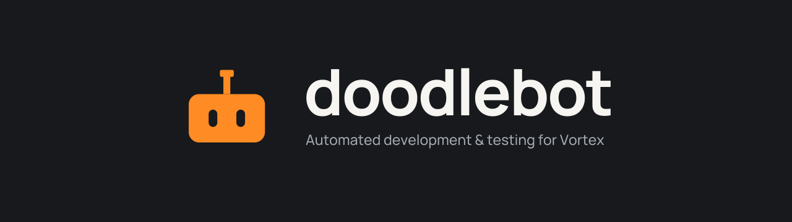

<p align="center">
  
</p>

# Doodlebot

**Reproduce Vortex bugs, write repeatable tests and find out where the app spends its time.**
Doodlebot drives the real app and gives you its state, UI, logs and measurements. Run it
from PowerShell or TypeScript, or connect an LLM assistant through MCP. App inspection and
core workflows work with a stock released Vortex, so you can get started without building
Vortex from source.

## Useful things to do with it

| Your task                      | What Doodlebot provides                                                                         | Guide                                                   |
| ------------------------------ | ----------------------------------------------------------------------------------------------- | ------------------------------------------------------- |
| Reproduce a bug                | Disposable app profiles, actual UI/state, logs and screenshots                                  | [First session](docs/getting-started/first-session.md)  |
| Write regression tests         | Real-app fixtures, MCP actions and independent Playwright/filesystem checks                     | [Test writing](docs/testing/integration.md)             |
| Investigate freezes            | Reproducible large libraries, collection fixtures, CPU profiles and responsiveness measurements | [Benchmarks](docs/testing/benchmarks.md)                |
| Inspect mods and conflicts     | Structured profile/mod/plugin/download inventories and diagnostics                              | [Tool use](docs/guides/calling-tools.md)                |
| Verify install/deploy behavior | Local archives and a fake game, with assertions against deployed bytes                          | [Mod workflows](docs/guides/mod-workflows.md)           |
| Give an LLM access to Vortex   | Local MCP tools and owned sessions; you choose the task and permitted actions                   | [LLM setup](docs/llms/connecting.md)                    |
| Develop a Vortex fix           | Managed source worktrees, builds and review evidence                                            | [Source development](docs/guides/source-development.md) |

## Documentation

**[Read the human documentation site](https://doodlum.github.io/vortex-doodlebot/)** for
setup, direct commands, LLM workflows, complete CLI/MCP/helper references, automated test
writing, benchmarks and troubleshooting. Its Markdown source is in [`docs/`](docs/index.md).

## Quick start

On Windows, install Vortex, Node **20.19+** and **pnpm 9.15.0**, then run from this checkout:

```powershell
$env:VORTEX_AI_OWNER = 'operator'
$env:VORTEX_AI_INSTALLED = '1'
pnpm install --frozen-lockfile
pnpm run build
pnpm run ai -- doctor --installed --sandbox
pnpm run ai -- setup --installed --sandbox
pnpm run ai -- tools --json
pnpm run ai -- snapshot
pnpm run ai -- down --installed --sandbox
```

The sandbox supplies a disposable fake game, so this needs no game install or Nexus account.
Keep the same owner, target and slot/cache throughout the session. Live collections have additional
[login and download prerequisites](docs/getting-started/authentication.md).

## Current state

The toolkit has 58 MCP tool registrations, 40 CLI commands and reusable TypeScript helpers.
The latest [kit CI run](https://github.com/doodlum/vortex-doodlebot/actions/runs/37673176382)
at revision `1729a39` passed the kit checks, including 675 unit tests in 58 files and the
documentation controls. Its released Vortex 2.8.0 suite passed 20 of 21 checks; the lifecycle
test failed because Vortex did not exit cleanly. An earlier run at `343fd18` passed all 21.
The shutdown failure remains unresolved. Optional scenarios need their own checks.

Doodlebot supplies the automation and evidence tools; your LLM client supplies the model,
planning and delegation. You choose the intended behavior and what may happen to personal
data. Changes still need human review, and upstream maintainers decide what to accept and release.

## Develop and verify

```powershell
pnpm run ci                  # kit checks; no app or account needed
pnpm run ai:test:core        # separate real-app contract with anonymous fixtures
pnpm run docs:check          # paired documentation and source-reference checks
```

See [contributing](docs/contributing.md) and [documentation maintenance](docs/maintaining-documentation.md)
for scoped checks, site preview and keeping documentation current with code changes.

Based on [vortex-mcp](https://github.com/alandtse/vortex-mcp) by Alan Tse.
License: [GPL-3.0-only](LICENSE.md).
