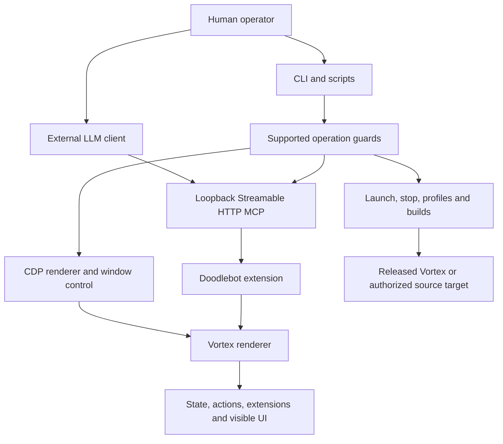

# Architecture and limits

Doodlebot has two parts. An extension inside Vortex's renderer exposes state and UI through
MCP tools. A Node/TypeScript harness outside the app prepares profiles, starts and stops
processes, manages builds, drives CDP and supplies test fixtures and evidence reports.

## Why use the real app?

Real-app tests catch problems in archive installation, React input handling, deployed files
and renderer reload that pure-logic mocks cannot establish. The core integration fixtures
run a released app and check results independently through Playwright and the filesystem.
The extension keeps working against stock Vortex; main-process/window capabilities stay in
the harness rather than requiring a Vortex patch.

## Reflected APIs

`vortex_describe` discovers selectors, action creators, extension APIs, events and methods.
`vortex_query` reads state or selectors. `vortex_dispatch` invokes available writes when
enabled by a bearer token. Verified hints explain known positional arguments and caveats.
An API missing from those hints may still be callable, but needs investigation before use. Scoped inventories
avoid enormous raw-state responses.

## Ownership boundaries

Leases reserve app caches and source checkouts; operation guards exclude supported
conflicting commands for their duration. Known child processes retain protection until exit.
Kit publication is serialized by a separate writer reservation.

These controls work when callers use the supported harness paths. Raw MCP/CDP, manual
Git/filesystem operations and external builders do not automatically participate, so the
controls are not a security sandbox. Direct clients must coordinate their operations and
stay within the permitted task.
