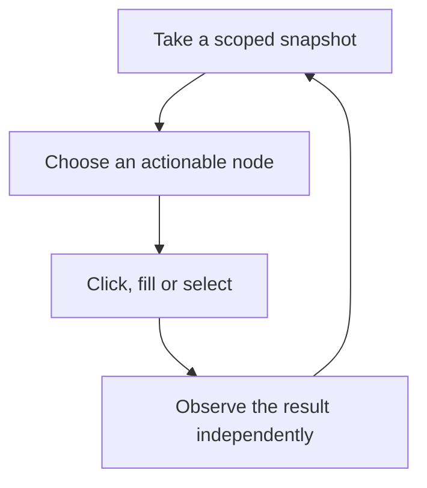

# Drive the UI

Use the UI tools to reproduce a button, form or dialog problem. If you only need a mod or
profile inventory, the state tools are easier to work with. To test a visible control,
exercise it directly: changing state through another API leaves its UI behavior untested.

## Inspect, act, verify



```powershell
pnpm run ai -- snapshot
# Replace this placeholder with a real reference from that snapshot:
pnpm run ai -- click --ref '<current-ref>'
pnpm run ai -- snapshot
```

Snapshot references belong to the renderer's current generation. Another snapshot, even
from a different client, can invalidate them. Reload creates a new renderer lifetime.
Virtualized tables also reuse rows as you scroll, so take a fresh snapshot before acting.

Scope snapshots with `--selector` or the `ui_snapshot` input when a modal or table is large.
The tool supports `index` for multiple matches, hidden nodes, depth/node limits and optional
bounding boxes. Inspect `truncated` before treating a missing node as proof of absence.

## Use meaningful selectors

Prefer roles, accessible labels and `data-testid` attributes. Generated class names and row
positions can change across Vortex versions or scrolling. In a TypeScript script:

```typescript
const node = await kit.ui.clickByName(mcp, { role: "button", name: "Manage" });
```

Replace the example's role and name with a control you have observed in the app.
`clickByName` and `fillByName` take a fresh snapshot while holding that client's UI lock.
If more than one control matches, they report ambiguity and leave you to narrow the target.

## Wait for the result

Use `ui_wait_for` with `selector` or visible `text`, a desired state and a timeout. For a
test, prefer Playwright's awaited locator assertions. A fixed sleep can finish before the
action does, or waste time after it is already complete; waiting for the result makes a
failure easier to diagnose.

`ui_press_key` emits DOM events. Native typing, default keyboard actions and actual pointer
or wheel input can require CDP/Playwright. Use `kit.realHover` and `kit.realWheel` when the
native behavior is what the test measures.

## Dialogs and installers

`ui_active_dialogs` and `list_dialogs` list open app feedback. The driver handles a defined
set of dialogs and includes helpers for advancing FOMOD installers. Read those policies
before unattended installation:
a destructive foreign-deployment purge is refused unless explicitly permitted for a
disposable game. Inspect an unknown dialog before choosing how to answer it.

The helper lock serializes operations on one client object. It does not coordinate every
external MCP client. Have one operator inspect and act on a renderer at a time, or use separate
[owned sessions](parallel-sessions.md).

For regression checks, use MCP to act and Playwright or file contents to verify. See
[writing real-app tests](../testing/integration.md).
