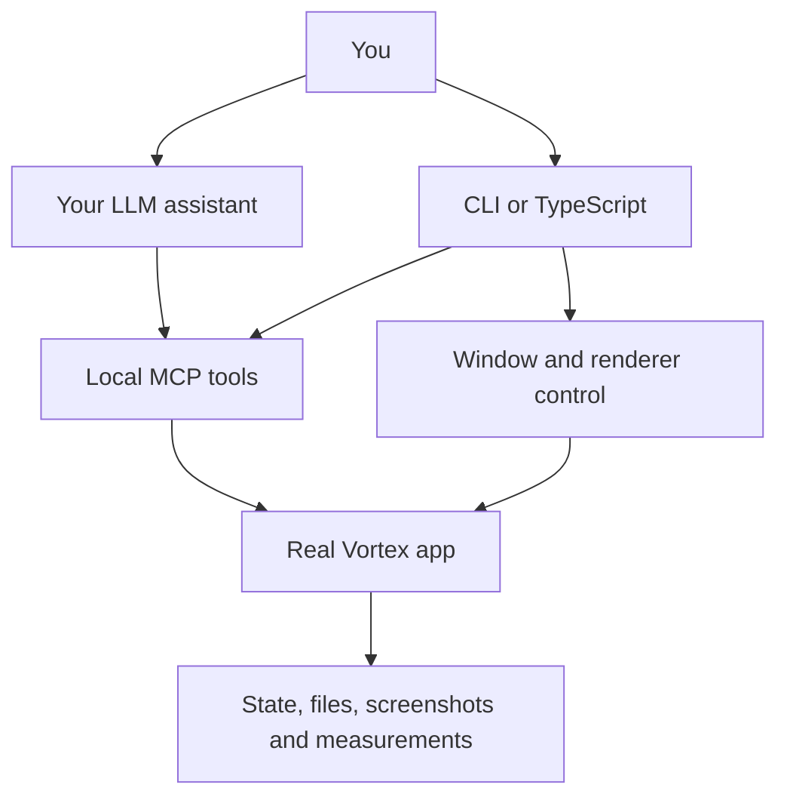

# What can you do with Doodlebot?

{ .hero }

**Reproduce a bug, turn it into a test, or measure what makes a large mod list slow.**
Doodlebot drives the real Vortex app and lets you inspect its state, UI, files and logs.
Use the CLI from your terminal, write repeatable tests and benchmarks with the TypeScript
helpers, or connect an LLM assistant through MCP.

## Choose a useful first task

| You want to…                            | Use Doodlebot to…                                                                                                     | Start with                                                                                            |
| --------------------------------------- | --------------------------------------------------------------------------------------------------------------------- | ----------------------------------------------------------------------------------------------------- |
| Reproduce a reported bug                | Start a disposable profile, repeat the exact actions, save logs and screenshots                                       | [Your first session](getting-started/first-session.md), then [UI automation](guides/ui-automation.md) |
| Turn a bug into a regression test       | Drive Vortex through MCP and check the result independently with Playwright or file contents                          | [Write a real-app test](testing/integration.md)                                                       |
| Find out why a big mod list freezes     | Seed a reproducible library, measure frame gaps and CPU time, then compare baseline and candidate runs                | [Benchmarks](testing/benchmarks.md)                                                                   |
| Investigate mods, profiles or conflicts | Query state, list inventories and diagnostics without manually copying information from every screen                  | [Call tools](guides/calling-tools.md), then [MCP reference](reference/mcp-tools.md)                   |
| Verify installation and deployment      | Install a local archive into a fake game, check the deployed bytes, disable it and verify purge                       | [Mod workflows](guides/mod-workflows.md)                                                              |
| Let an LLM help debug or test Vortex    | Connect its MCP client, give it a concrete task and choose the actions it may take                                    | [Connect your assistant](llms/connecting.md)                                                          |
| Develop a Vortex fix                    | Use a separate source worktree, reproduce before changing code, run the applicable checks and prepare review evidence | [Source development](guides/source-development.md)                                                    |
| Check a visual change                   | Capture the actual window and test both width and height changes, dialogs and keyboard interaction                    | [Screenshots and layout](guides/capture.md)                                                           |

## What you need

The app workflows run on **Windows**, with Vortex installed, Node **20.19 or newer** and the
repository's pinned pnpm **9.15.0**. The account-free sandbox supplies a disposable fake game;
you do not need a game install or Nexus account for the first session or core tests.
Live collection downloads need additional [account prerequisites](getting-started/authentication.md).

[Install Doodlebot](getting-started/installation.md){ .md-button .md-button--primary }
[Open your first session](getting-started/first-session.md){ .md-button }

## How you use it

Doodlebot supplies the tools, test fixtures and session controls. If you use an assistant,
its client supplies the LLM, reasoning and task scheduling; Doodlebot has no built-in model
or autonomous scheduler. You can work with a stock released
Vortex; source changes and features such as user-folder redirection require a source build.

## Current state and practical limits

The core toolkit is implemented and tested. The recorded verification of code revision
`343fd18` on **7 October 2026** passed 675 unit tests in 58 files and 21 account-free integration
checks against official Vortex 2.8.0. Later branding-only CI also passed. Optional live-service,
game and performance scenarios need their own checks; these results cover the recorded runs.
See the repository's [Actions](https://github.com/doodlum/vortex-doodlebot/actions) for individual runs.

The tools expose **58 MCP registrations**, **40 CLI commands** and reusable script helpers.
Availability depends on your runtime and bearer-token configuration. Diagnostics help you
investigate; you still choose conflict winners, intended behavior and actions on real user
data. Tests establish what happened in the tested scenario. Human review and maintainer
approval govern merging and releasing code. Read [security and privacy](security.md) before using personal profiles.

## Direct tools or an assistant?

Use direct commands when you know the next action, need a repeatable procedure or are writing
tests. Use an LLM when you need help exploring an unfamiliar problem, interpreting results or
developing a scoped change. Both routes use the same underlying app. Start with a disposable
session, and retain the observations needed to check the result yourself.
